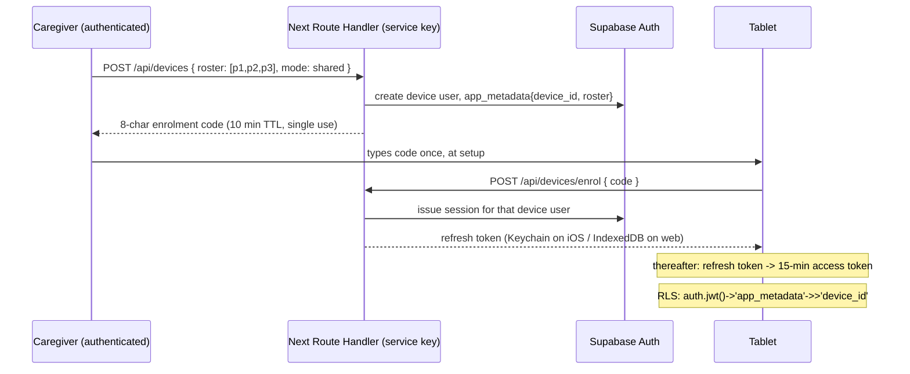

# Proposal: Next.js App Router full-stack, offline PWA patient surface, Capacitor iOS later

**Advocate brief.** Written to be cross-examined. Version numbers verified against the npm registry and vendor docs on 2026-08-12, not from memory.

---

## 0. Thesis in one line

One Next.js 16 App Router repo gives us a real server tier we will need anyway (privileged export, de-identification, device credential minting, telemetry ingest) plus per-route code splitting for three radically different UIs — and the patient surface is a hard-partitioned client-only offline island inside it, so server-first never touches the tablet.

That is the honest version. The dishonest version of this pitch is "server components everywhere, it's all one app." It is not all one app in the way that phrase implies, and I will say exactly where the seam is and what it costs.

---

## 1. Verified version landscape (checked 2026-08-12)

| Package | Version confirmed | Why it earns its place |
|---|---|---|
| `next` | **16.3.0** (LTS, released 2026-08-03) | Router, per-route code splitting, Route Handlers, static export target for native. Next 15 LTS support ends 2026-10-21, so 16.3 is the only sane entry point. |
| `react` / `react-dom` | **19.2.8** | Required by Next 16. |
| `@supabase/supabase-js` | **2.112.3** | Postgres/Auth/Storage client. Note: v3 does **not** exist; anyone claiming offline-native supabase-js in 2026 is wrong. Offline is our problem to solve. |
| `@supabase/ssr` | **0.12.4** | Cookie-based session for the server-rendered caregiver/researcher surfaces. Replaces the dead `auth-helpers`. |
| `supabase` (CLI) | **2.113.0** (dev dep) | Local Postgres + Auth + Storage in Docker, real migrations, `db push` to cloud at the end. Directly satisfies requirement 3. |
| `serwist` + `@serwist/next` | **9.5.12** | Service worker / precache. The maintained successor to the abandoned `next-pwa`; the official Next.js PWA guide names it and ships both Turbopack and webpack examples. |
| `dexie` | **4.4.4** | IndexedDB with transactions, typed tables, and blob storage. ~25 kB gz. Hand-rolling IndexedDB for an append-only outbox that must never lose data is exactly the wrong place to save a dependency. |
| `zod` | **4.4.3** | The frozen contract. Every HTTP boundary and every stored record shape. This is the single most load-bearing dependency for requirement 9. |
| `tailwindcss` | **4.3.3** | One install, three token sets. See §8. |
| `typescript` | **7.0.2** (native compiler) | ~10x faster typecheck than 5.x, which matters for "fast headless test runs". **Verification item:** confirm type-aware ESLint rules work on day 1; fall back to `5.9.3` if not. |
| `vitest` + `@vitest/coverage-v8` | **4.1.10** | Unit + contract tests. |
| `happy-dom` | **20.11.2** | DOM for component tests; ~3x faster than jsdom 30. |
| `@playwright/test` | **1.62.1** | E2E including `context.setOffline(true)` — the only credible way to test the three-day-offline scenario. |
| `msw` | **2.15.0** | Lets a blind test-writer mock the frozen HTTP contract without any implementation existing. |
| `@testing-library/react` | **16.3.2** | Component tests against accessible roles, not internals — blind-writable. |
| `recharts` | **3.10.1** | Researcher charts only. ~100 kB gz, loaded on researcher routes only. |
| `@capacitor/core` `/cli` `/ios` | **8.5.0** | Phase 2 native. |
| `@capacitor/camera` / `filesystem` / `preferences` | **8.2.2 / 8.1.2 / 8.0.1** | Phase 2: native capture, native file storage, Keychain-backed credential storage. |

**Direct declared dependencies: 11 prod + 12 dev = 23 for the web build; +6 for the native build = 29 total.** Transitive `node_modules` will land around 550–700 packages, dominated by Playwright and the Tailwind/PostCSS chain. Measure it on day one with `npm ls --all --parseable | wc -l` and put the number in the README. I am not going to pretend a Next+Playwright tree is small.

Things I deliberately do **not** propose: no shadcn/ui scaffold (it drags in Radix primitives repo-wide), no state library (Zustand/Redux — the patient surface is a state machine over Dexie; the caregiver surface is forms + server state), no date library (`Intl` covers it), no ORM (migrations are SQL, the client is supabase-js), no `next-auth` (Supabase Auth is the auth), no ffmpeg anywhere.

---

## 2. The shape of the thing

```
apps/web            Next 16, all three surfaces, deployed to a Node host
  app/(patient)     client-only, force-static, service-worker precached
  app/(care)        caregiver — RSC shell + client forms
  app/(clinic)      researcher — RSC, server-side aggregation, export
  app/api/*         Route Handlers: the frozen HTTP contract
apps/native         Next 16 with output:'export', patient+caregiver routes only, wrapped by Capacitor
packages/contract   zod schemas + generated OpenAPI. FROZEN. The test boundary.
packages/core       pure TS: scheduler, outbox, dedup, de-identification. No React, no Next, no network.
packages/patient-ui  React components shared by apps/web and apps/native
supabase/migrations  real SQL, applied locally and pushed to cloud unchanged
```

The monorepo is a pnpm workspace. **This is a real cost and it is the price of the iOS destination** — see §4 for why I am not pretending a single Next app can be both server-rendered and statically exported.

### Which surface gets which rendering model

| Surface | Model | Justification |
|---|---|---|
| **Patient** | 100% client. `export const dynamic = 'force-static'`. Zero server function calls at runtime. | Server-first would actively destroy this surface. So it gets none of it. |
| **Caregiver** | RSC shell for navigation/lists, client components for capture forms and upload. Must remain statically exportable (see §4) — so no `cookies()`, no Server Actions in this route group. | Server rendering buys real value here (fast first paint on a phone, no auth flash) but I am constraining it so the surface can ship natively later. Honest: **I get less out of RSC on the caregiver surface than a naive Next pitch claims,** because the native destination forbids the good bits. |
| **Researcher** | Full server. RSC, server aggregation, streamed tables, Route Handler exports. Never ships natively. | This is where server-first genuinely pays: cohort queries over millions of telemetry rows must not be shipped to a browser, and de-identification must happen server-side or it isn't de-identification. |

### The seam, enforced

The failure mode of this architecture is an agent importing a server-only helper into `app/(patient)`. Enforcement, all in CI:

1. `import/no-restricted-paths` ESLint rule: `app/(patient)/**` and `packages/patient-ui/**` may import only from `packages/core`, `packages/contract`, `dexie`, `react`. Not `@supabase/ssr`, not `next/headers`, not `server-only`.
2. `apps/native` builds with `output: 'export'` in CI on every PR. Any `cookies()`, Server Action, dynamic Route Handler, or `proxy.ts` usage reachable from those routes **fails the build immediately** — Next errors on all of these under static export. This is the good news: the constraint is machine-enforced by the framework, not by discipline.
3. A Playwright test that loads the patient route with `setOffline(true)` from a cold service worker and asserts a full session completes. If anyone adds a server dependency, this test goes red.

Point 2 is the strongest structural answer to "does server-first fight offline": **the native build is a continuous, automated proof that the patient surface has no server dependency.** We find out on every commit, not at App Store submission.

---

## 3. Offline behaviour: the care-home tablet, three days, no wifi

### What is on the device before the wifi dies

- **App shell**: precached by Serwist at install. HTML, RSC payloads for the static patient routes, JS, CSS, fonts. ~1.5 MB.
- **Content**: cards and schedule for a rolling **14-day prefetch horizon**, in Dexie.
- **Media**: every photo and audio clip referenced by that horizon, stored as **Blobs in Dexie**, not in the Cache API.

That last choice is deliberate and I will defend it. Supabase Storage private objects are fetched via signed URLs. Cache API entries are keyed by URL; when the signature rotates, every cached entry becomes a miss and the tablet silently loses its media. Storing the decoded blob keyed by `media_id` decouples the cache from the URL entirely. Playback is `URL.createObjectURL(blob)` — instant, no network, no decode stall. Budget: ~300 photos downscaled to 1600px (~150 MB) + ~200 audio clips (~40 MB) ≈ **200 MB per resident**, LRU-evicted outside the horizon, horizon items pinned.

### Day 1–3 with no wifi

Nothing changes for the patient. Every session runs entirely from Dexie. Card scheduling is computed locally by `packages/core` — a pure function of the local event log — so the device does not need the server to decide what to show next. This is only possible because the scheduling state is a **fold over the review event stream**, not a server-owned mutable row (see §5).

### Telemetry that is never lost

Every interaction is written to an `events_outbox` Dexie table **in the same IndexedDB transaction that commits the UI state change**. There is no window in which the UI has advanced but the event is unrecorded. Each row carries:

```
{ device_id, boot_id, seq, patient_id, session_id, card_id,
  type, client_wall_ms, client_monotonic_ms, payload }
```

- `seq` is a strictly increasing per-device counter persisted in Dexie.
- `(device_id, boot_id, seq)` is the **idempotency key**, backed by a unique index server-side. The ingest endpoint upserts, so replaying a batch is free and duplicates are impossible.
- Rows are deleted **only** after a 2xx acknowledgment naming the accepted seq range. Crash mid-flush → resend → dedup.
- `client_monotonic_ms` is `performance.now()`, immune to clock changes. **All latency measurements are intra-session deltas of monotonic values**, so a wrong tablet clock cannot corrupt the research data. The server stamps `server_received_at` and records the wall-clock offset per batch for absolute-time reconstruction.

Volume: ~500 events/resident/day × 3 days × 8 residents ≈ 12,000 rows ≈ 4 MB. IndexedDB will not blink. Even a 30-day outage is ~40 MB.

### What actually breaks

Honestly, in order of likelihood:

1. **Content goes stale past the horizon.** Day 15 offline and the tablet is repeating old cards. Mitigation is the horizon length and a caregiver-visible "last synced" badge; there is no way around it and no stack solves it.
2. **Storage eviction.** On iOS Safari, a home-screen-installed PWA gets `navigator.storage.persist()` granted, but WebKit can still purge under storage pressure, and deleting the home-screen icon deletes everything. **This is the strongest argument for reaching Capacitor sooner rather than later**, because under WKWebView the same IndexedDB lives in the app container: not subject to browser eviction heuristics, and included in device backup. The native path is a robustness upgrade, not just a distribution channel. I would not run a multi-year care-home pilot on a browser PWA with a three-day queue depth.
3. **A caregiver deletes a card while the tablet is offline.** The tablet shows it anyway. Every event carries `card_version`, so the researcher view can filter post-hoc. Accepted, documented, not solved.

---

## 4. iOS: the weakest flank, answered straight

### The mechanism

`apps/native` is a second Next build of the **same components** with `output: 'export'`, producing static HTML/JS/CSS into `out/`, wrapped by Capacitor 8.5.0. Confirmed from the Next 16.3 static export docs: Server Components **are** supported (they run at build time), Client Components are supported, and Route Handlers are supported only as `force-static` GET. Unsupported and therefore forbidden in that route group: `cookies()`, Server Actions, rewrites/redirects/headers, `proxy.ts`, ISR, dynamic routes without `generateStaticParams`, and default-loader image optimization.

So the native build ships: patient surface + caregiver surface + `packages/core` + `packages/patient-ui`, talking directly to Supabase over HTTPS. The researcher surface is web-only. Native swaps three implementations behind interfaces already defined in `packages/core`:

| Web | Native | Why |
|---|---|---|
| `<input capture>` / MediaRecorder | `@capacitor/camera` 8.2.2 | Native picker quality, no Safari upload quirks |
| Dexie blob store | Dexie (WKWebView) + `@capacitor/filesystem` 8.1.2 for large media | App-container storage, backup-eligible, no eviction |
| Device credential in IndexedDB | `@capacitor/preferences` 8.0.1 → iOS Keychain | **This is the fix for the stolen-tablet problem.** See §6. |

### Effort, honestly

- Xcode project generation, icons, splash, entitlements, provisioning: 1–2 days.
- Wiring the three swapped implementations: 3–5 days, because the interfaces exist from day one.
- The route-group discipline: **free if enforced from commit 1, expensive if retrofitted.** This is why `apps/native` builds in CI from the very first week even when it does nothing useful.
- Apple Developer Program, App Store Connect, TestFlight distribution to care homes: ~2 days plus review latency.

Total: **roughly two weeks of real work, not two months** — conditional on the CI enforcement being there from the start. If it is not, budget a month and a lot of swearing.

### Will Apple accept it?

Guideline **4.2 Minimum Functionality**, verbatim: *"Your app should include features, content, and UI that elevate it beyond a repackaged website. If your app is not particularly useful, unique, or 'app-like,' it doesn't belong on the App Store."* And **4.2.2**: apps *"shouldn't primarily be marketing materials, advertisements, web clippings, content aggregators, or a collection of links."*

Our app uses the camera, the microphone, local persistent storage, full offline operation, and (later) push. It is not a web clipping and it has no equivalent public website for a patient to visit. Capacitor apps of this shape ship constantly. **My honest read: low rejection risk, but not zero, and it is a risk a React Native or Expo proposal does not carry at all.** That is a fair hit to take in cross-examination and I am not going to argue it away.

Two harder guidelines that bite *this* product regardless of stack, and which the principal should know about now:

- **2.5.6**: web content must use WebKit. Capacitor uses WKWebView. Compliant.
- **1.4.1 Medical Apps**: *"Medical apps that could provide inaccurate data... may be reviewed with greater scrutiny... Apps should remind users to check with a doctor."* We need an in-app disclaimer. Cheap.
- **5.1.3(iv), verbatim**: *"Apps conducting health-related human subject research must secure approval from an independent ethics review board."* And **5.1.3(iii)**: consent from participants or, for those who cannot consent, their guardian — which is exactly the dementia case. **Requirement 7's "heavy research telemetry" plus App Store distribution means an IRB/REC letter is a submission blocker.** This applies identically to every stack on the table, but it is the kind of thing that surfaces at week 20 and costs three months. Surface it at week 1.

### What I am NOT proposing

Pointing Capacitor's `server.url` at the hosted Next app. It would let us keep server rendering everywhere and it would be a disaster: it breaks offline entirely, and it is precisely the "repackaged website" that 4.2 exists to reject. Rejected.

---

## 5. Sync and conflicts

The design goal is **no conflict resolution code at all**, achieved by giving every piece of data exactly one writer.

| Data | Writer | Reader | Conflict? |
|---|---|---|---|
| Cards, media, schedule config | Caregiver (online) | Patient device (read-only) | None by construction |
| Review/interaction events | Patient device (append-only) | Server, researcher | None — appends never conflict |
| Card scheduling state | **Nobody.** Derived. | Everyone | None — it is a fold over the event log |
| Consent records | Caregiver / clinician | All | Append-only, versioned |

Card state being derived is the load-bearing idea. Both the tablet (locally, in `packages/core`) and the server (in SQL, over the same event stream, ordered by `(session_id, seq)`) compute the same state from the same events with the same pure function. Two tablets for one resident? The server folds both event streams in timestamp order and gets one answer. A tablet that was offline for three days catches up by replaying its own events, then re-folding. **Last-writer-wins never appears, because nothing is written twice.**

The same pure fold function is used in both places — shipped from `packages/core`, and the server-side equivalent is verified against it by a property test that runs 10,000 random event sequences through both and asserts identical output. That test is blind-writable from the contract alone.

Sync loop on the device: on regaining connectivity, (1) flush outbox in batches of 200 with exponential backoff, (2) pull content diff since `last_sync_cursor`, (3) fetch any newly-referenced media blobs, (4) evict outside the horizon. Media upload from the caregiver phone uses Supabase Storage resumable uploads, so a dropped connection mid-upload resumes rather than restarts.

---

## 6. Auth, three roles, and the shared stolen tablet

### Caregiver and researcher

Supabase Auth. Email OTP for caregivers (no passwords to forget), TOTP MFA mandatory for researchers. Role and org membership live in `app_metadata` (server-writable only, so a user cannot escalate themselves), and every table has RLS keyed off `auth.uid()` and those claims. The researcher role reads only from de-identified views — `patient_id` replaced by a per-study pseudonym, dates shifted per subject by a fixed random offset, free text excluded — and the underlying tables have **no** researcher-readable policy at all, so a mistake in the view layer fails closed.

### The patient device — the hard part

**A patient device never holds a patient's credentials, because there aren't any. It holds a *device* identity that is scoped to a roster.**



Design notes that matter under cross-examination:

- **No custom JWT signing.** The device gets a genuine Supabase session, so RLS, Storage policies, and Realtime all work with zero bespoke crypto. Supabase has been moving to asymmetric signing keys and away from the shared HS256 secret; minting our own tokens would put us on the wrong side of that migration. (Fallback if the managed path proves unworkable: server-minted scoped JWTs from a Route Handler — same claims, more maintenance. Verification item for week 1.)
- **Roster scoping is the blast radius control.** A stolen shared tablet reaches exactly the residents assigned to *that* tablet. Not the care home, not the cohort, not the study. This is the single most important property and it is enforced in Postgres, not in the client.
- **Revocation is one click.** Caregiver marks the tablet lost → the device user is banned → the next refresh (≤15 min) fails → the app wipes local media and the roster. Access tokens are 15 minutes, so the online exposure window is bounded by that.
- **Offline for three days does not break auth.** The device needs no valid token while offline; it reads and writes only Dexie. The refresh token is long-lived and survives the outage; on reconnect it exchanges for a fresh access token and flushes. If the device was revoked during the outage, the flush fails 401 and the app wipes — after making one attempt to hand the queued events to the server, which is the correct order for a *revoked-but-honest* tablet and irrelevant for a stolen one.
- **The face grid does not authenticate anything.** Tapping a face selects which resident's session to run; the token already permits all of them. There is no privilege boundary between residents on one tablet, and pretending otherwise would be security theatre. If a care home needs a hard boundary between two residents, they get two tablets, and that is a policy answer not a code answer.

### Where this is genuinely weak, stated plainly

**On the web PWA, a thief with the unlocked tablet gets the refresh token out of IndexedDB and gets the cached photos and audio off disk.** Encrypting the local store with a key that is also in IndexedDB is theatre. There is no browser secure-key store. The real controls in the PWA phase are: device passcode, MDM, iPadOS Guided Access locking the app, short access-token TTL, roster scoping, and fast revocation.

**Capacitor is what actually fixes it**: the refresh token moves to the iOS Keychain with `kSecAttrAccessibleAfterFirstUnlock`, and media in the app container is covered by iOS Data Protection tied to the device passcode. So the security story and the reliability story point the same direction — get to native — and the PWA phase is an honest interim with named, documented residual risk that the pilot's DPIA must record.

---

## 7. Media capture, storage, caching

**Capture (caregiver).** Photos: `<input type="file" accept="image/*" capture="environment">` on the web, `@capacitor/camera` natively. Downscale client-side to 1600px longest edge via `createImageBitmap` + `OffscreenCanvas` → JPEG q0.82, typically 300–600 kB. No dependency; the platform does it.

**Audio is the one real trap and I will name it before someone else does.** `MediaRecorder` on Chrome historically emits `audio/webm;codecs=opus`, which **Safari and WKWebView cannot play** — so a family recording on an Android phone would be silent on the patient's iPad. The fix, with zero dependencies: request `audio/mp4` (AAC), which both Safari and modern Chrome support, via `MediaRecorder.isTypeSupported`; if unavailable, decode with `AudioContext.decodeAudioData` and write a WAV header by hand (~1.4 MB/min, uncompressed, universally playable). A codec-compatibility unit test with fixture files from both browsers is non-negotiable. No ffmpeg, no server transcoding.

**Storage.** Supabase Storage private buckets, path `patients/{patient_id}/{media_id}`, storage RLS policies keyed on the same roster claim used by the tables. Resumable uploads for audio over care-home wifi. Metadata row in Postgres is the source of truth; an orphaned object without a row is garbage-collected nightly.

**Caching.** Covered in §3: Dexie blob table keyed by `media_id`, never by signed URL; horizon pinning; LRU eviction; object URLs at render time.

---

## 8. Styling three UIs without three codebases

Tailwind v4.3.3, one install, one `@theme`, three **surface token sets** applied at each route group's layout root:

```css
@layer base {
  .surface-patient { --step-0: 2rem;   --tap-min: 6rem; --contrast: aaa; --radius: 1.5rem; }
  .surface-care    { --step-0: 1rem;   --tap-min: 2.75rem; }
  .surface-clinic  { --step-0: 0.8125rem; --tap-min: 2rem; --density: compact; }
}
```

Every component reads tokens, never raw values. Concretely for the patient: minimum 96px touch targets, 32px base type, WCAG AAA 7:1 contrast, no hover states at all (they lie on touch), no animation over 200ms, no navigation chrome, no destructive action reachable by a single tap. For the clinic: 13px base, dense tables, Recharts.

Component libraries: **none installed globally.** Patient UI is ~8 bespoke components — a library would fight every one of the constraints above. For the caregiver/researcher surfaces I would add Radix primitives for exactly the three things that are genuinely hard to get right accessibly (Dialog, Select, Popover) and nothing else; that is ~8 transitive packages, scoped to two route groups. If the principal wants it at zero, we hand-roll and accept slightly worse focus management on desktop.

**Bundle honesty.** Next 16's shared baseline first-load JS is around 105 kB gz. Patient route ≈ **135–160 kB gz** (baseline + Dexie + app code). Caregiver ≈ 180 kB. Researcher ≈ 280 kB with Recharts. A Vite SPA would put the patient surface at ~70–90 kB. **Next costs the patient tablet roughly 50–70 kB gz of framework it does not need** — that is a real, honest tax, paid once at install and then served from the service worker cache forever. On a five-year-old iPad the parse cost is a few tens of milliseconds on cold start. I think that is a fair price for one repo, one router, and per-route splitting that keeps Recharts off the tablet entirely. Someone could reasonably disagree.

---

## 9. Test infrastructure and the blind-agent contract

This is where Next earns its keep for requirement 9, and it is my strongest argument.

**The frozen contract is `packages/contract`**: zod schemas for every HTTP request/response, every IndexedDB record, and every domain event, plus a generated OpenAPI document, plus the SQL migrations, plus a written RLS policy table. Test-writer agents read **only** this package and the spec. Implementer agents read the spec and may not read `**/*.test.ts` (CI enforces via a check on the diff).

| Layer | Tool | What a blind writer can assert without seeing code |
|---|---|---|
| Unit | Vitest 4.1.10 | `packages/core` is pure functions with signatures in the contract: scheduler fold, outbox dedup, de-identification. Property tests included. |
| Contract | Vitest + zod | Every endpoint: valid input → response matches schema; invalid input → 422 with the contract's error shape. Generated *from* the OpenAPI doc, so the tests are nearly mechanical. |
| RLS / data | Vitest + local Supabase (CLI 2.113.0) | The most blind-testable layer that exists: "as a device token with roster [p1], `select * from events where patient_id=p2` returns 0 rows." Pure specification, zero implementation knowledge. Every policy gets a positive and a negative test. |
| Component | Testing Library 16.3.2 + happy-dom | Queried by accessible role and label, both of which are specified in the UI contract. No internals. |
| Client-offline | Vitest + MSW 2.15.0 + fake-indexeddb | Outbox survives simulated crashes; replay produces no duplicates. |
| E2E | Playwright 1.62.1 | Three projects: caregiver (desktop+phone viewport), patient (iPad viewport), clinic (desktop). Offline via `context.setOffline(true)`. |

**The scenario test that decides whether this whole proposal is real:**

```
1. seed 3 residents, 60 cards, 40 media
2. patient tablet syncs, then goes offline
3. run 24 full sessions across 3 simulated days, all offline
4. assert: every session completed, every media element played from cache
5. assert: outbox length == expected event count, exactly
6. go online, wait for flush
7. assert: server event count == local count, zero duplicates, zero loss
8. replay the flush twice more; assert count is unchanged (idempotency)
```

That runs headless in Playwright in under two minutes and it is writable, in full, by an agent that has never seen a line of the implementation.

**Speed:** unit <5 s, contract <30 s, RLS suite ~60 s (local Supabase already warm), E2E 2–4 min, typecheck <5 s with TS 7. The slow link is `next build` for E2E — Turbopack in 16.3 makes it tolerable but it is still the biggest number in the loop.

**Native testing gap, stated:** Playwright cannot drive a Capacitor app. We test the *exported bundle* served locally with the same Playwright suite — which covers the code, not the native shell — plus a short XCUITest smoke suite for camera/Keychain/permissions. That gap is real and shared by every web-based native strategy.

---

## 10. Hosting

Deploy `apps/web` as a Node server. Vercel is the frictionless default (preview deploys per PR are genuinely useful for a three-surface product with clinicians reviewing), but **health data means a BAA, and on Vercel that is an Enterprise-tier conversation** — verify before committing. The mitigation is designed in from day one: we adopt a hard rule of **no Vercel-only primitives** — no Vercel Blob, no Edge Config, no ISR-dependent patterns, nothing that isn't plain Next. `output: 'standalone'` then produces a Docker image that runs identically on Fly, Railway, or a Hetzner box in the right jurisdiction. Supabase's HIPAA offering is likewise a paid add-on on a higher tier; both are verification items for week 1, not week 20.

Cloud handoff is four environment variables (`NEXT_PUBLIC_SUPABASE_URL`, publishable key, server-only secret key, and the app's own `APP_SECRET`) plus `supabase link && supabase db push`. Because development ran against local Supabase with real migrations the whole way, that push is boring — which is the entire point of requirement 3.

---

## 11. The three biggest risks of my own proposal

**1. iOS is a second build target, and the discipline that makes it cheap is invisible until it fails.**
Next is not a native framework. The honest path is a static export in a WKWebView, which means every line reachable from the patient and caregiver route groups must avoid the best parts of Next forever. CI catches it — `output: 'export'` errors loudly — but only if `apps/native` builds from week one. Skip that, and this becomes a two-month retrofit discovered at submission time. On top of that, the WKWebView shell carries a small but genuinely non-zero 4.2 rejection risk that an Expo/React Native proposal simply does not have. If the principal's confidence in "must become a real iOS app" is high and their tolerance for App Store roulette is low, **that is a legitimate reason to prefer a native-first stack over mine**, and I would rather say so than get caught pretending otherwise.

**2. Two rendering models in one repo is a split brain, and blind agents will fall into the seam.**
Requirement 9 puts implementation in the hands of agents who cannot see the tests, and requirement 10 says less is more. A Vite SPA has one mental model; this has two, plus a monorepo, plus a route-group rule that is not visible from inside any single file. The ESLint boundary and the native CI build are good enforcement, but "good enforcement of avoidable complexity" is a weaker position than "no complexity to enforce." I claim the payoff — a real server tier for export, de-identification, and device credential minting, which the pure-client stacks must build as Supabase Edge Functions in a second language and a second deploy pipeline anyway — is worth it. That is a judgment call, not a fact.

**3. Framework weight and churn on the surface that can least afford either.**
The patient tablet is the oldest, weakest device in the system and it pays ~50–70 kB gz of framework it does not use. Worse, App Router's caching and data semantics have changed materially across 13 → 14 → 15 → 16 (Cache Components and the middleware→proxy rename in 16 alone). A clinical pilot may run for three years; Next 16.3 is LTS but Next 15's support ends in October 2026, which tells you the cadence. Budget real time for at least one major upgrade during the pilot, and expect it to land on the surface where regressions hurt most.

**Honorable mentions:** the Supabase JWT-signing-key migration could force the device-auth design onto the fallback path (bounded, one week); Safari's `MediaRecorder` codec situation is a live trap (§7); and the IRB requirement in guideline 5.1.3(iv) is a submission blocker that no amount of good architecture removes.

---

## 12. What would change my mind

If the principal says the iOS app must ship in the first three months, or must feel indistinguishable from native, or must run on care-home tablets with no MDM and a meaningful theft rate — then the WKWebView shell is the wrong bet and Expo/React Native wins on the strength of Keychain, background upload, and a rejection risk of zero. My case is strongest when "iOS later" genuinely means *later*: web pilot first, native as a planned second phase, with the seam machine-enforced from the first commit so that phase is two weeks and not two months.
